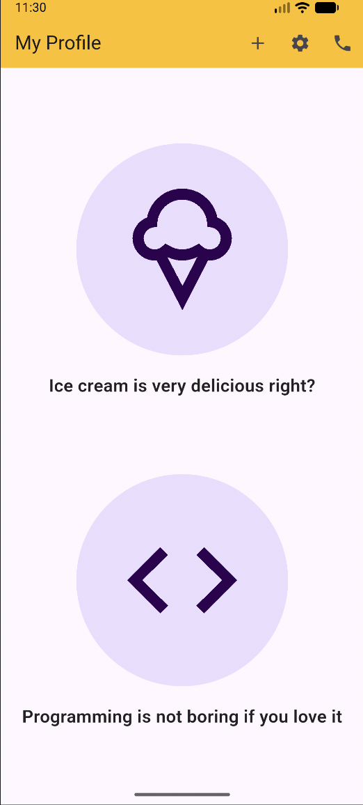

# 📱 Assignment B19 | Module 5 - My Profile UI

A pixel-perfect and highly responsive **Flutter Profile UI Application** built using native layout widgets. This project demonstrates core layout structures, custom color styling, and typography implementation in Flutter.

---

## 📸 App Preview & Screenshot

Here is the visual output of the implemented design:



---
## ✨ Features

- **Custom Styled AppBar:** Features a vibrant amber-yellow background (`#FFFFC008`) with proper actions containing `add`, `settings`, and `phone` buttons.
- **Perfect Spacing:** Implements `MainAxisAlignment.spaceEvenly` to distribute components proportionately across any screen height.
- **Custom Themed Avatars:** Utilizes nested iconography inside large circular containers with a soft lavender (`#FFEADDFF`) background and deep purple (`#FF2E004F`) icons.
- **Centered Clean Typography:** Structured text components with medium-bold styling and explicit center alignment.

---

## 🧱 Widget Tree Architecture

The UI structure of this screen is built as follows:

```text
Scaffold (Background: #FFFEF7FF)
 └── AppBar (Background: #FFFFC008, Actions: [add, settings, phone])
 └── SizedBox (Width: double.infinity)
      └── Column (MainAxisAlignment: spaceEvenly)
           ├── Column (Ice Cream Section)
           │    ├── CircleAvatar (Radius: 120, Background: #FFEADDFF) ──> Icon (icecream_outlined)
           │    └── Text ("Ice cream is very delicious right?")
           └── Column (Programming Section)
                ├── CircleAvatar (Radius: 120, Background: #FFEADDFF) ──> Icon (code)
                └── Text ("Programming is not boring if you love it")
```

---

## 🛠️ Code Configuration Details

- **Framework:** Flutter (StatelessWidget)
- **Background Color:** `0xFFFEF7FF`
- **Accent Purple Color:** `0xFF2E004F`
- **Font Styling:** Size `20`, Weight `w600` (Semi-Bold)

---

## 🚀 How to Run the Project Locally

1. **Clone the repository:**
   ```bash
   git clone https://github.com/mazbaul20/Assignment-b19-b5
   ```
2. **Navigate into the directory:**
   ```bash
   cd Assignment-b19-b5
   ```
3. **Fetch packages:**
   ```bash
   flutter pub get
   ```
4. **Run on an active emulator/device:**
   ```bash
   flutter run
   ```

---
🙋‍♂️ **Submitted By:** [Md Mazbaul Islam](https://github.com/mazbaul20/Assignment-b19-b5)  
🆔 **Batch:** Flutter Batch 19  
🎯 **Module:** 05 Assignment
